# Micro Web Framework in Java

### author: tomas felipe ramirez alvarez

---

This project was developed for the Application Servers workshop in TDSE. The solution implements a micro web framework without external HTTP dependencies, built with sockets, reflection, and custom Java annotations.

The goal of the project is to demonstrate how to build a minimal Apache-like web server and, on top of that server, an IoC framework capable of publishing web services defined from POJOs.

## Contents

1. General Description
2. Covered Objectives
3. Solution Architecture
4. Project Structure
5. Requirements and Build
6. Running the Server
7. Framework Usage
8. Example Application
9. Functional Validation
10. Delivery Evidence
11. Conclusions

## 1. General Description

This project implements a minimal HTTP server that:

- Listens for TCP connections on a configurable port.
- Interprets HTTP `GET` requests.
- Returns dynamic responses from annotated Java controllers.
- Serves static files from the classpath.
- Supports HTML and PNG content.
- Resolves query parameters through annotations.

The application was designed as a simple, understandable, and academic prototype focused on showing how Java reflection can be used to discover components, inspect methods, and invoke them dynamically.

## 2. Covered Objectives

This implementation covers the main technical requirements of the workshop:

- Custom web server in Java.
- HTML page support.
- PNG image support.
- Minimal IoC framework for building web applications from POJOs.
- Support for the `@RestController`, `@GetMapping`, and `@RequestParam` annotations.
- Explicit bean loading from the command line.
- Automatic component discovery by scanning the classpath.
- Example web application deployed on top of the framework.
- Sequential handling of multiple non-concurrent requests.
- Maven-based project structure and lifecycle.

## 3. Solution Architecture

The main framework class is `MicroSpringBoot`. It contains the core responsibilities of the server and the route dispatcher.

### Main Components

#### Class Design

The architecture relies on a few core entities:
- **`MicroSpringBoot`**: The core server engine managing the `ServerSocket` and thread pool (`ExecutorService`).
- **`RouteHandler`**: Binds an instantiated controller to a mapped `Method`.
- **`HttpRequest`**: Structure holding the parsed request path and query parameters.
- **`StaticResource`**: Wrapper for static files (HTML/PNG) and their content types.

| Component | Responsibility |
| --- | --- |
| `MicroSpringBoot` | Starts the server, discovers controllers, registers routes, processes HTTP requests, and serves static files. |
| `RestController` | Marks a class as a web component managed by the framework. |
| `GetMapping` | Declares the URI associated with an HTTP GET method. |
| `RequestParam` | Binds query string parameters to controller method arguments. |
| `HelloController` | Example controller with basic endpoints and a simple HTML response. |
| `GreetingController` | Controller that demonstrates the use of `@RequestParam` and state handling with `AtomicLong`. |

#### Class Diagram

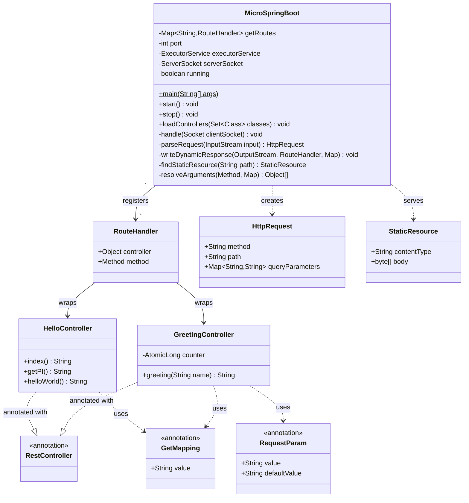

### Request Handling Flow

1. The server opens a `ServerSocket` on the configured port.
2. An incoming connection is accepted.
3. The first HTTP line is read and the method, path, and query string are extracted.
4. If the path matches a `@GetMapping`, the framework invokes the POJO method through reflection.
5. If the path is not dynamic, a static resource is searched inside `src/main/resources/static`.
6. The HTTP response is written with `Content-Type`, `Content-Length`, and the corresponding body.
7. The connection is closed and the server waits for the next request.

### Design Idea

The implementation avoids external web server libraries. All HTTP handling is performed with standard Java classes, making it easier to understand how a web framework can be built from scratch.

## 4. Project Structure

```text
Application_servers/
├── pom.xml
├── mvnw
├── mvnw.cmd
├── README.md
└── src/
	├── main/
	│   ├── java/
	│   │   └── org/example/demo/
	│   │       ├── MicroSpringBoot.java
	│   │       ├── RestController.java
	│   │       ├── GetMapping.java
	│   │       ├── RequestParam.java
	│   │       ├── HelloController.java
	│   │       └── GreetingController.java
	│   └── resources/
	│       ├── application.properties
	│       └── static/
	│           ├── index.html
	│           └── images/
	│               └── server.png
```

## 5. Requirements and Build

### Requirements

- Java 21 or higher.
- Maven Wrapper included in the project.

### Build

From the project root in PowerShell:

```powershell
.\mvnw.cmd package
```

## 6. Running and Deploying the Server

### Generating and Deploying via Docker (AWS/EC2)

To generate the Docker images and deploy the application (e.g., in an AWS EC2 instance), use the provided `Dockerfile` and `docker-compose.yml`.

1. **Build the application:**
   ```powershell
   .\mvnw.cmd clean package
   ```

2. **Generate Image and Run with Docker Compose:**
   ```bash
   docker-compose up -d --build
   ```
   This command automatically builds the `web` container image using the project's `Dockerfile`, spins up a MongoDB container if needed, and binds the server to port `8087`.

3. **Building and running manually with Docker:**
   ```bash
   docker build -t org.example/micro-spring-boot .
   docker run -d -p 35000:35000 --name micro-web org.example/micro-spring-boot
   ```

### Standard execution with automatic controller discovery

```powershell
java -cp target/classes org.example.demo.MicroSpringBoot
```

The server starts on port `35000` and makes the application available at:

```text
http://localhost:35000/index.html
```
### Configurable port

The default port is defined in `src/main/resources/application.properties`.

It can also be changed from the command line:

```powershell
java -cp target/classes org.example.demo.MicroSpringBoot --port=8080
```

## 7. Framework Usage

The framework exposes a simple annotation-based model.

### `@RestController`

Indicates that a class must be detected by the framework as a web component.

```java
@RestController
public class HelloController {
}
```

### `@GetMapping`

Publishes a method on an HTTP GET URI. The method must return a `String`.

```java
@GetMapping("/hello")
public String helloWorld() {
	return "Hello World";
}
```

### `@RequestParam`

Obtains a parameter from the URL. It may have a default value.

```java
@GetMapping("/greeting")
public String greeting(@RequestParam(value = "name", defaultValue = "World") String name) {
	return "Hola " + name;
}
```

## 8. Example Application

The example application includes dynamic routes and static resources.

### Dynamic Endpoints

| Endpoint | Description | Example response |
| --- | --- | --- |
| `GET /` | HTML page generated by the controller | Simple HTML document |
| `GET /hello` | Test greeting | `Hello World` |
| `GET /pi` | PI value | `PI: 3.141592653589793` |
| `GET /greeting` | Greeting with default value | `Hola World (#1)` |
| `GET /greeting?name=Tomas` | Greeting with parameter | `Hola Tomas (#2)` |

### Static Resources

| Resource | Type |
| --- | --- |
| `GET /index.html` | `text/html` |
| `GET /images/server.png` | `image/png` |

### Useful links for browser testing

- `http://localhost:35000/`
- `http://localhost:35000/index.html`
- `http://localhost:35000/hello`
- `http://localhost:35000/pi`
- `http://localhost:35000/greeting`
- `http://localhost:35000/greeting?name=Pedro`
- `http://localhost:35000/images/server.png`

## 9. Functional Validation

It was verified locally that:

- `GET /greeting?name=Tomas` responds correctly using `@RequestParam`.
- `GET /index.html` returns `Content-Type: text/html; charset=UTF-8`.
- `GET /images/server.png` returns `Content-Type: image/png`.

Examples in PowerShell:

```powershell
Invoke-WebRequest -UseBasicParsing http://localhost:35000/hello | Select-Object -ExpandProperty Content
Invoke-WebRequest -UseBasicParsing "http://localhost:35000/greeting?name=Tomas" | Select-Object -ExpandProperty Content
(Invoke-WebRequest -UseBasicParsing http://localhost:35000/index.html).Headers['Content-Type']
(Invoke-WebRequest -UseBasicParsing http://localhost:35000/images/server.png).Headers['Content-Type']
```

## 10. Delivery Evidence

- Screenshot of the successful build with `./mvnw.cmd package`.
  - 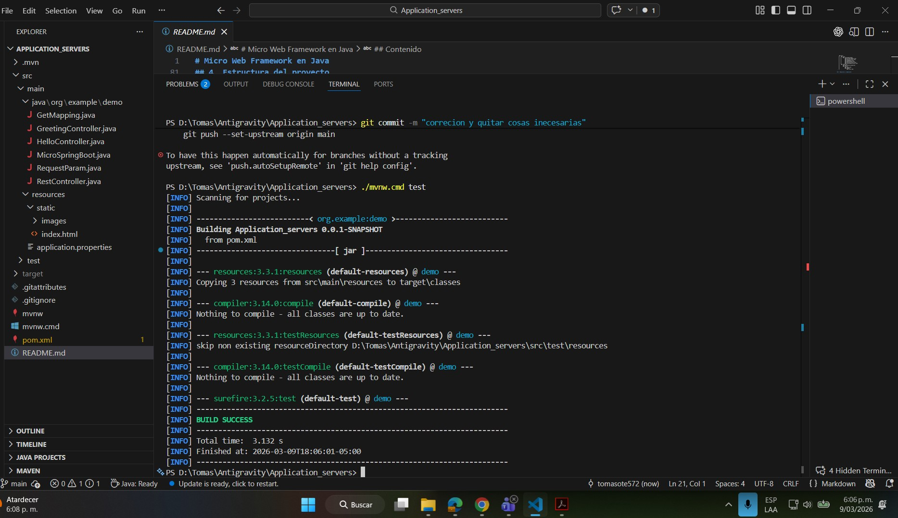

- Screenshot of the console showing server startup.
  - 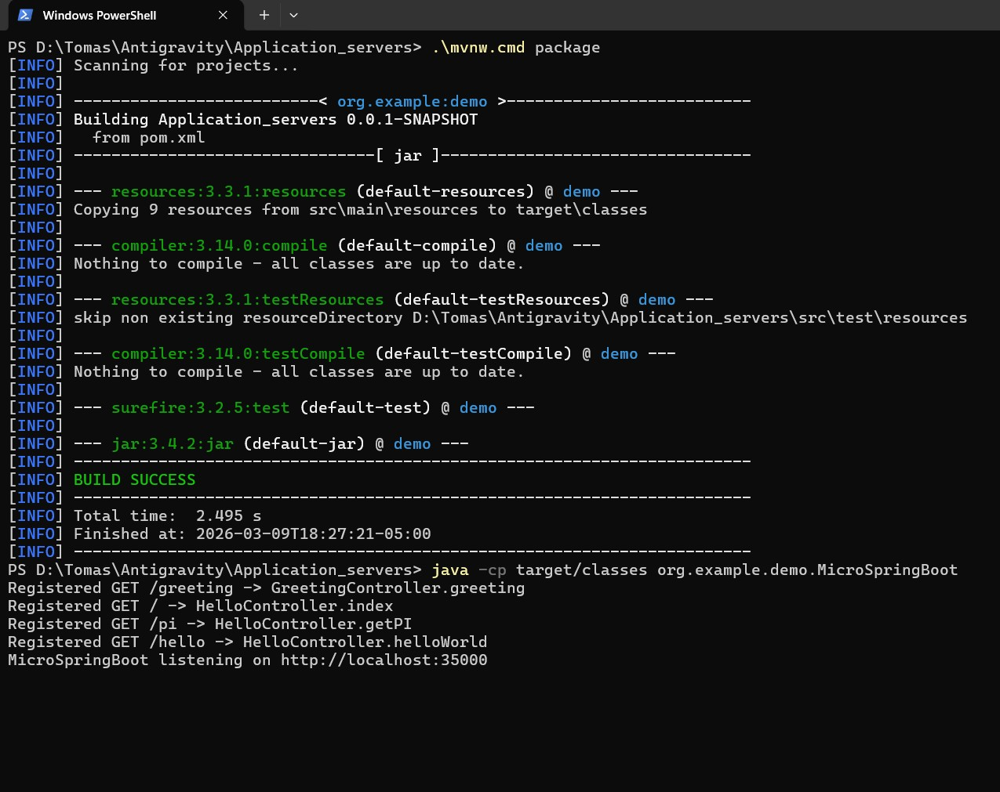
- Screenshot of the browser opening `http://localhost:35000/index.html`.
  - 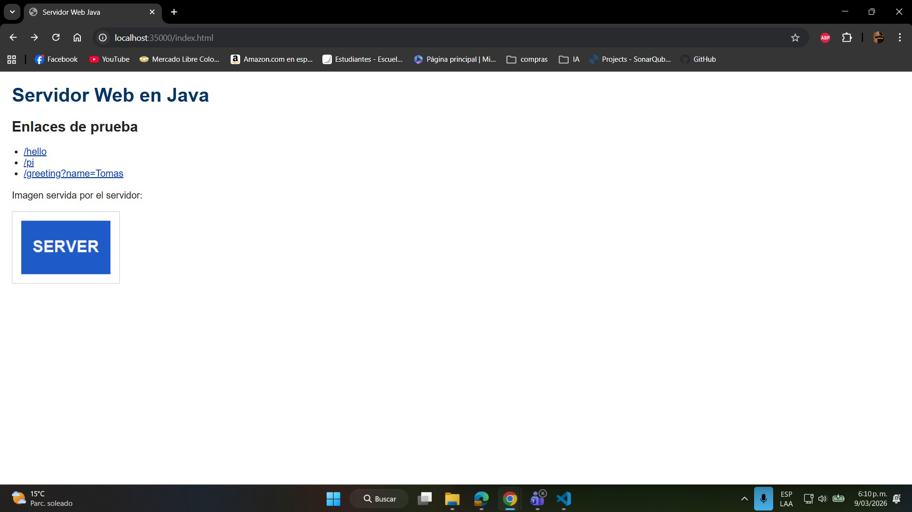
- Screenshot of the URL `http://localhost:35000/greeting?name=YourName`.
  - 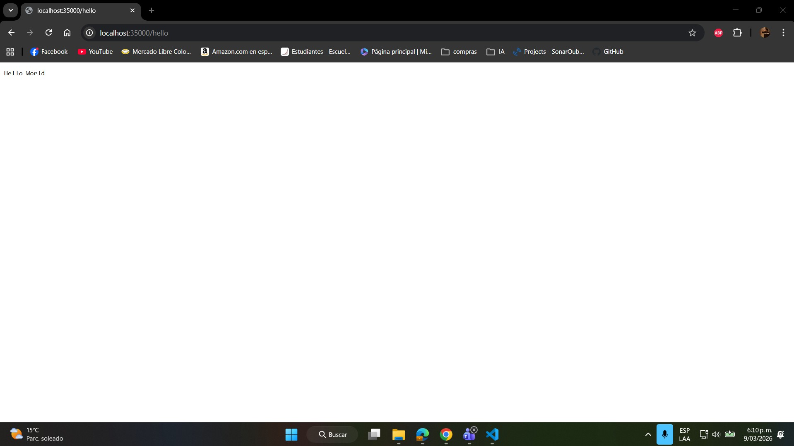
  - 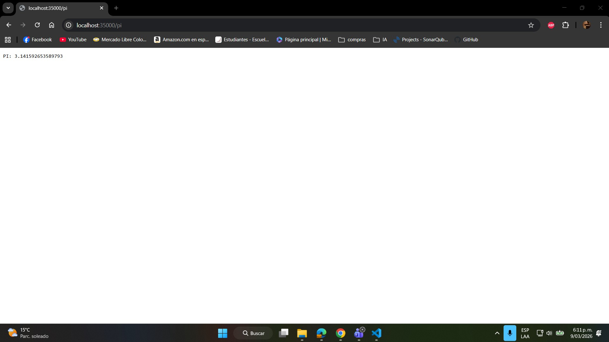
  - 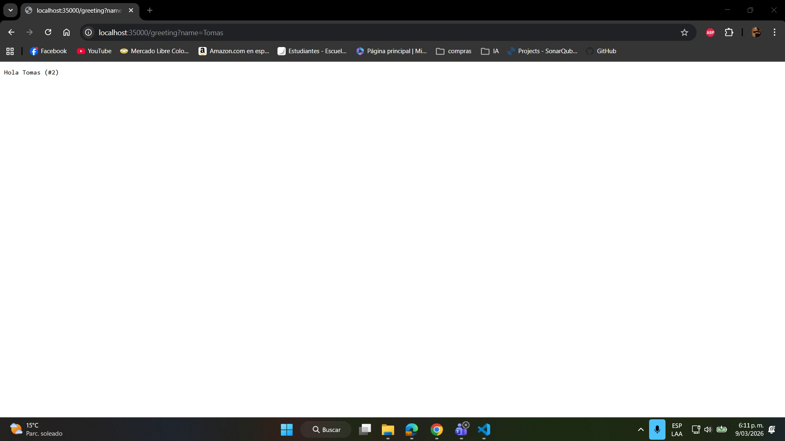
- Evidence of deployment on AWS and successful application access.
  - 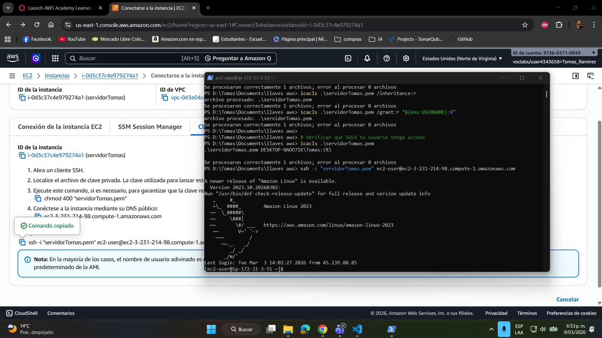
  - 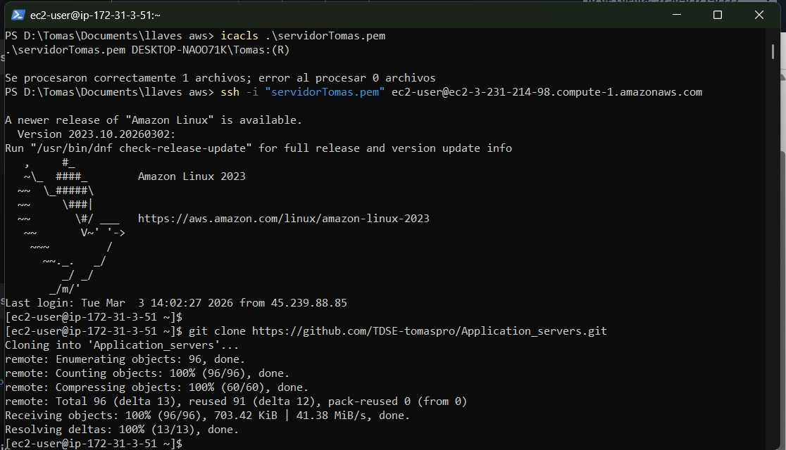
  - 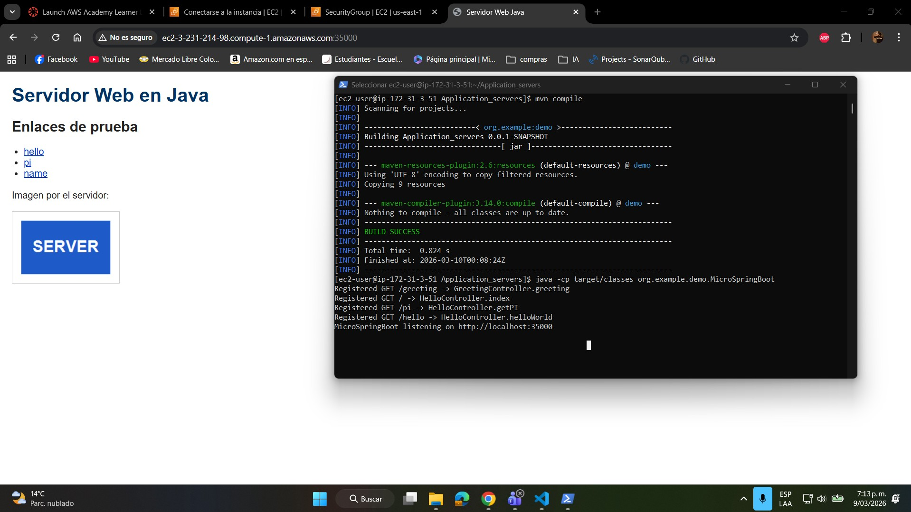
  - 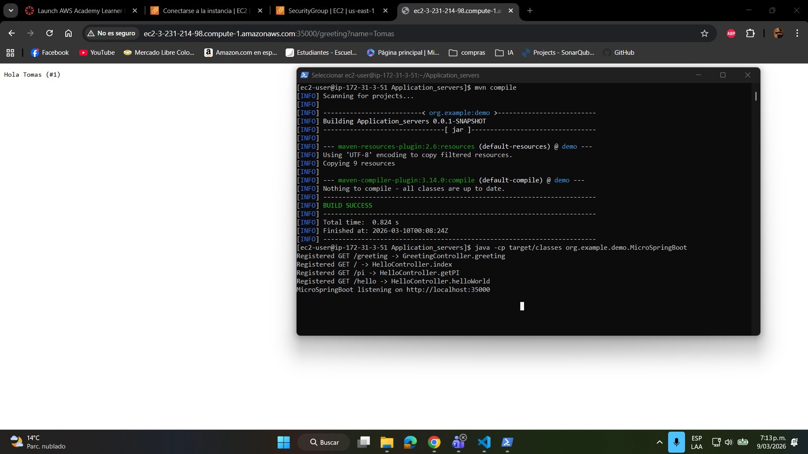
- images to display it
  - 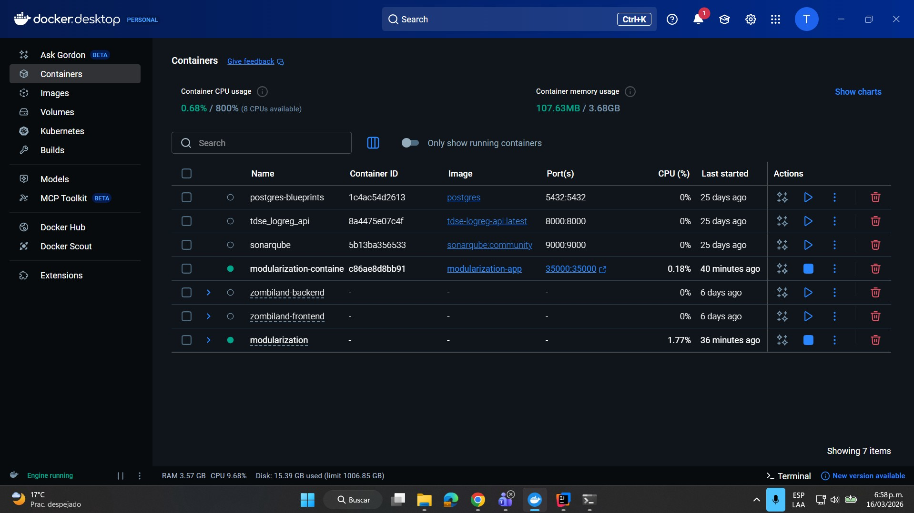 
  - 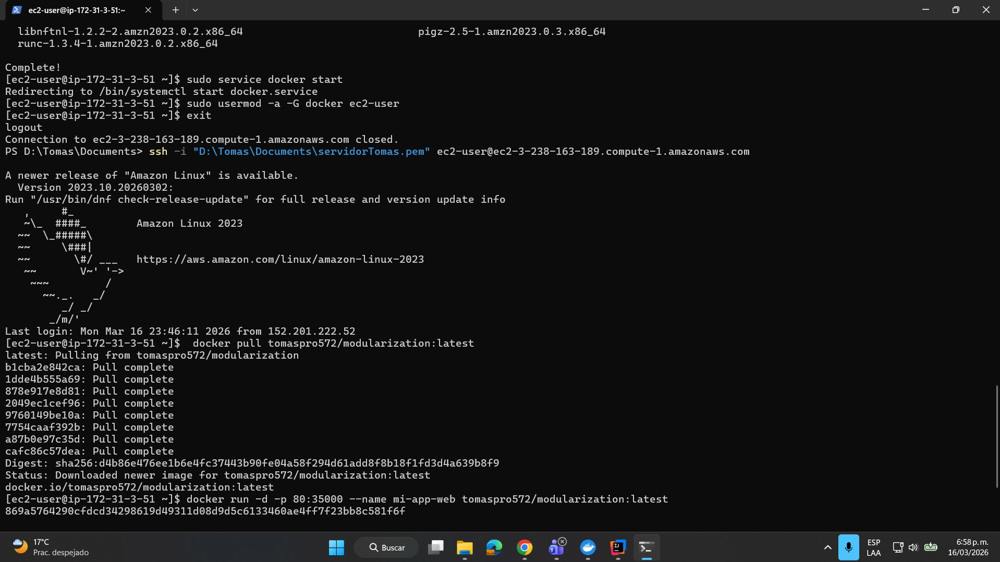 
  - 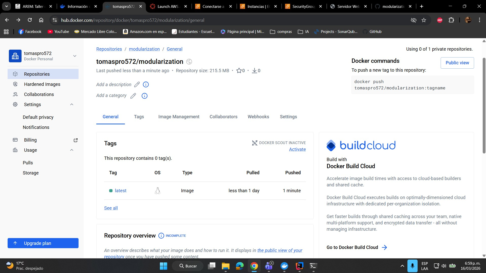 
  - 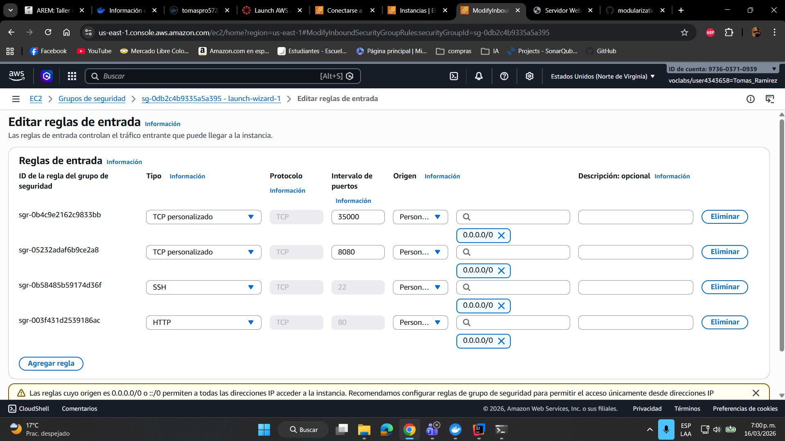
- AWS deployment with video
  - https://youtu.be/TGviYyM2hjY?si=mIbt8qWcQiyP3eVB


## 11. Conclusions

1. It was possible to build a functional web server in Java using only sockets, without relying on external HTTP frameworks.

2. The use of reflection and annotations made it possible to implement a minimal IoC framework capable of discovering controllers, registering routes, and invoking methods dynamically.

3. The example application demonstrates that the server can deliver both dynamic content and static resources, meeting the HTML and PNG support requested in the workshop statement.

4. The project confirms that with a simple architecture and Maven as the build foundation, it is possible to develop a clear, extensible prototype aligned with the academic objectives of the workshop.

5. The successful containerization of the framework with Docker and its active deployment on an AWS EC2 instance proves that this custom-built Java web server can be seamlessly packaged and run in a modern, distributed cloud environment.

